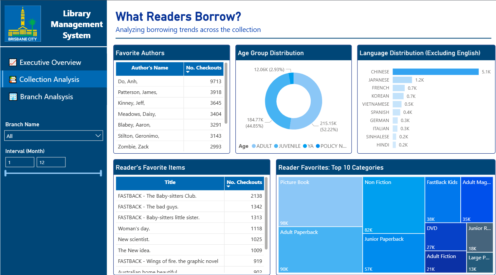
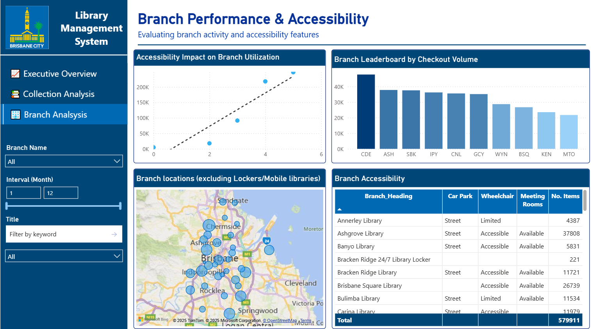

# Brisbane City Council Library Management System – Data Analysis Project  

## 📚 Overview  
During my Professional Year course, my trainer - Prashant - once told me that "If you want to keep improving yourself, you need to read. Books give you the chance to step into someone else’s thoughts, learn from their experience, and expand your own perspective. Without that, he said, you’ll eventually stop moving forward." Those lines stuck with me, because it captures why libraries are so much more than shelves of paper — they are gateways to learning, imagination, and growth.  

This project grew out of that idea. I wanted to understand how people in Brisbane actually use their public libraries: what they borrow, when they visit, which branches are busiest, and how accessibility affects community engagement. To do that, I took raw open data from Brisbane City Council and transformed it into a story about reading behavior across the city.  

The journey wasn’t smooth. Like most real-world data, the library records came with missing values, inconsistent formats, and mismatched fields that had to be cleaned and aligned before any analysis could happen. But solving those challenges was part of the point — it turned messy information into something structured and meaningful.  

By the end, I built a set of dashboards that show not just numbers but patterns: the rush of borrowing, the presence of multiple languages that reflect Brisbane’s diversity, and the way branch accessibility drives community engagement. The insights here are not just statistics — they can help guide future funding, collection planning, and service improvements so that libraries remain welcoming and relevant for everyone.  

## 🎯 Objectives  
- Clean and preprocess raw library datasets with **missing values** and **inconsistent formats**  
- Design a **relational SQL schema** for efficient integration and analysis  
- Perform **exploratory SQL queries** on borrowing, collections, and branches  
- Build an **interactive Power BI dashboard** to communicate findings  

## 👥 Stakeholders  

The insights from this project can serve different stakeholders inside and outside the library system:  

- **Library management**: to evaluate branch performance, spot trends in borrowing, and plan resources such as staffing, facilities, and new branch investments.  
- **Librarians and staff**: to understand peak times, popular items, and user behavior so they can provide better service and optimize daily operations.  
- **City council and policymakers**: to assess community engagement, identify targeted cohorts specific attentions, and ensure equitable resource distribution.  
- **Community and readers**: to benefit from improved services, better accessibility, and targeted programs that encourage the reading culture.  

## ⚙️ Tools & Technologies  
- **Python (Google Colab)** → Data cleaning, transformation, and integration  
- **SQL (MS SQL Server)** → Schema design, complex queries, stored procedures  
- **Power BI** → Executive dashboards and visual storytelling  

## 🧠 Data Challenges & Solutions  
- **Missing Data** → Addressed gaps in branch metadata and transaction fields, applying conditional updates or exclusions where appropriate  
- **Mismatched Formats** → Standardized dates, times, branch codes, and categorical fields for consistency  
- **Data Integration** → Designed relational schema linking transactions, items, and branches to allow scalable querying  
- **Branch Metadata Gaps** → Added new library locker branches manually and updated codes to align with checkout records  

---

## 📊 Analyses & Insights  

### SQL Highlights   
The SQL analysis explored a wide range of questions about borrowing and branch activity:  

1. What is the trend of checkouts over months, and how does it change month to month?  
2. What are the top 10 most checked-out items overall?  
3. Who are the top 3 authors (with more than 10 checkouts) for each item type?  
4. How many checkouts are for non-English items, and what is the language breakdown?  
5. What are the top 10 most popular and least popular item types by checkout count?  
6. How do checkouts differ by age group?  
7. Which hour of the day sees the most borrowing activity, and when are the peaks?  
8. Which are the top 10 busiest branches by total checkouts?  
9. How accessible is each branch when considering parking, facilities, and meeting rooms?  
10. What are the most recent 4 quarterly checkout totals for each branch (using dynamic SQL)?  
11. How can a user search for all the books they’ve borrowed by keyword in the title?  
12. For a given book title, which branches have it available and when was it last checked out?  

👉 Full SQL script available in this repo.  

### Power BI Dashboard  

[Click here to interact with my dashboard 📈](https://app.powerbi.com/view?r=eyJrIjoiY2RkYjk4MWUtM2NlOS00NGM5LWE0MTktNWE4OTBkNjlhMjhiIiwidCI6IjFjYTRjNDdkLTU4ODEtNDE3Zi1iY2U0LTY2ZDNhMDZlMzk0MSJ9)

The final **Power BI dashboard** provides an interactive, user-friendly view of library activity:  
- **Executive Overview**: Total checkouts, distinct items, item types, and branches  
- **Monthly Checkouts Trend**: Fluctuations across 2024, capturing seasonal borrowing behavior  
- **Peak Hour Analysis**: Borrowing demand patterns across different hours of the day  
- **Branch Analysis**: Checkout activity by branch, and accessibility evaluation  

### 1. Executive overview

- **Borrowing peaks in March and December**  
 These months consistently recorded the highest checkout volumes. March and November aligns with the start and the end of school year, while April, July, and Octber reflects holiday season demand (mid-sem and semeter breaks). This suggests that seasonal cycles strongly influence library usage.  

- **Morning hours dominate borrowing activity (9 AM – 12 PM)**  
  Analysis of hourly checkouts shows a sharp rise starting at 8 AM, peaking between 9 AM and 12 PM. This indicates that libraries experience their busiest period in the morning, likely tied to opening hours, school visits, and routine borrowing habits.  

### 2. Collection Analysis – What Readers Borrow?

- **Favorite Authors**  
  *Anh Do* dominates with over 9,700 checkouts, far ahead of other popular authors like James Patterson and Jeff Kinney. This suggests there could be a relationship between writing styles and personal preferences.
  
- **Reader’s Favorite Items**  
  - The *FASTBACK series* (Baby-sitters Club, The Bad Guys, Little Sister) consistently ranks at the top, showing children’s fictional series drive significant borrowing activity.  
  - Popular magazines (*Woman’s Day, New Scientist, The New Idea*) also feature prominently, reflecting demand for short-form, regularly updated content.
  
- **Age Group Distribution**  
  - Borrowing is dominated by Adult (52.2%) and Juvenile (44.9%) readers, indicating that the library must balance both serious research/adult nonfiction with children’s entertainment/educational material.  
  - Young Adult (YA) readership remains small (~3%), suggesting targeted programs could help strengthen engagement.
  
- **Language Distribution (Non-English)**  
  Chinese (5.1K) leads the board, followed by a mix of other languages, reflecting clear multicultural demand, and volumes outside Chinese remain relatively modest.  
  
- **Category Preferences**  
  Picture Books (98K) and Adult Paperbacks (90K) lead borrowing volumes, confirming the importance of family and adult leisure reading, folloed by a range of diverse demand for multimedia and lifestyle content.

### 3. Branch Performance & Accessibility

- **Accessibility Impact**  
  Strong positive correlation between accessibility features (car parks, wheelchair access, meeting rooms) and higher branch utilization, suggesting potential infrastructure investment.
  
- **Branch Leaderboard**  
  - Chermside Library leads in checkout volumes, followed closely by Ashgrove, Sunnybank, and Indooroopilly. These branches combine high accessibility and strong local demand, making them essential hubs.  
  - Lower-performing branches may require targeted outreach or improved facilities.
  
### 4. Operational Implications
- **Collection Management**: Increase investment in popular children’s series, picture books, and adult paperbacks while sustaining nonfiction for adults.  
- **Community Engagement**: Develop programs/events for young aldult readers to lift engagement in this underrepresented group.  
- **Language Resources**: Maintain allocations for European and Asian languages to serve diverse communities.  
- **Branch Investment**: Prioritize accessibility upgrades (car parks, wheelchair access, meeting spaces) in underperforming branches to increase usage.  
- **Balanced Scheduling**: Borrowing activity is strong throughout the day, with mornings being peak and afternoons moderate. Afternoon coverage is still important, but resource allocation can be slightly lighter compared to mornings.

---

## 🚀 Skills Demonstrated  
- **Data Wrangling**: Cleaning, handling incomplete datasets, and resolving inconsistent formats  
- **SQL Expertise**: Advanced querying (CTEs, window functions, ranking, dynamic SQL, stored procedures)  
- **Data Modeling**: Designing relational schema for scalable and efficient analysis  
- **BI Storytelling**: Translating technical insights into executive-level dashboards  
- **Problem Solving**: Managing real-world data quality issues with practical solutions  

## 📂 Dataset Sources  
- [Library Checkouts 2024](https://data.brisbane.qld.gov.au/explore/dataset/library-checkouts-2024/information/)  
- [Library Branch Metadata](https://data.brisbane.qld.gov.au/explore/dataset/libraries-information-location/information/)  
